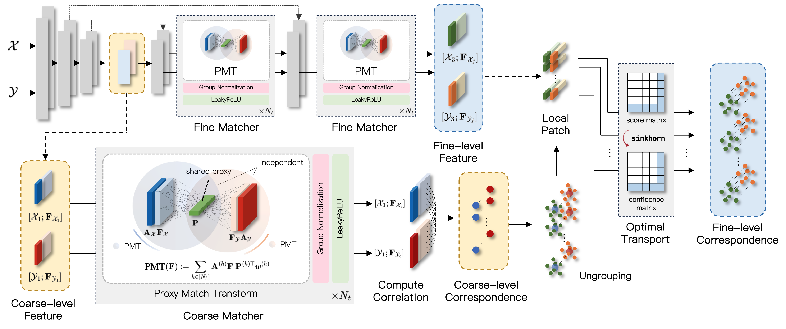

# [ICML'24] 3D Geometric Shape Assembly via Efficient Point Cloud Matching
This is the implementation of the paper "3D Geometric Shape Assembly via Efficient Point Cloud Matching" by [Nahyuk Lee](https://nahyuklee.github.io/), [Juhong Min](https://juhongm999.github.io/), [Junha Lee](https://junha-l.github.io/), [Seungwook Kim](https://wookiekim.github.io/), Kanghee Lee, [Jaesik Park](https://jaesik.info/) and [Minsu Cho](https://cvlab.postech.ac.kr/~mcho/). Implemented on Python 3.8 and Pytorch 1.10.1.

<p align="middle">
    
</p>

For more information, check out project [[website](https://nahyuklee.github.io/pmtr/)] and the paper on [[arXiv](https://arxiv.org/abs/2407.10542)].


## Requirements
- Python 3.8
- PyTorch 1.10.1
- PyTorch Lightning 1.9

Conda environment settings:
```
conda create -n pmtr python=3.8 -y
conda activate pmtr

pip install torch==1.10.1+cu111 torchvision==0.11.2+cu111 torchaudio==0.10.1 -f https://download.pytorch.org/whl/cu111/torch_stable.html
pip install pytorch-lightning==1.9
pip install einops trimesh wandb open3d

python setup.py build install
pip install git+https://github.com/KinglittleQ/torch-batch-svd
pip install git+'https://github.com/otaheri/chamfer_distance'
pip install "git+https://github.com/facebookresearch/pytorch3d.git@stable"
```

## Data Preparation
To use the Breaking Bad dataset, follow the instructions in [this repository](https://github.com/Breaking-Bad-Dataset/Breaking-Bad-Dataset.github.io?tab=readme-ov-file) to download both the `everyday` and `artifact` subsets.
- Note: We used the **volume constrained version** for both training and evaluation.

## Training
Additional arguments can be found in [`main.py`](./main.py).
```
# Single-GPU Training for pairwise assembly
python main.py --data_category {everyday, artifact} --fine_matcher {pmt, none} --logpath {exp_name} 

# Multi-GPU Training (ex. 4 GPUs) for pairwise assembly 
python main.py --data_category {everyday, artifact} --fine_matcher {pmt, none} --logpath {exp_name} --gpus 0 1 2 3 
```

## Testing
Additional arguments can be found in [`test.py`](./test.py).
```
python test.py --data_category {everyday, artifact} --fine_matcher {pmt, none} --load {ckp_path} 
```
### Checkpoints (Pairwise Assembly)
Checkpoints for both `everyday` and `artifact` subsets are available on our [[Google Drive](https://drive.google.com/drive/folders/1N7uXu0xR1O9cpPnJTP7d6susR6hDj5nn?usp=sharing)].

## BibTeX
If you use this code for your research, please consider citing:
````BibTeX
@article{lee2024pmtr,
  title={3D Geometric Shape Assembly via Efficient Point Cloud Matching},
  author={Lee, Nahyuk and Min, Juhong and Lee, Junha and Kim, Seungwook and Lee, Kanghee and Park, Jaesik and Cho, Minsu},
  journal={arXiv preprint arXiv:2407.10542},
  year={2024}
}
````

## Related Repos
The codebase is largely built on [GeoTransformer](https://github.com/qinzheng93/GeoTransformer) (CVPR'22) and [HSNet](https://github.com/juhongm999/hsnet) (ICCV'19).